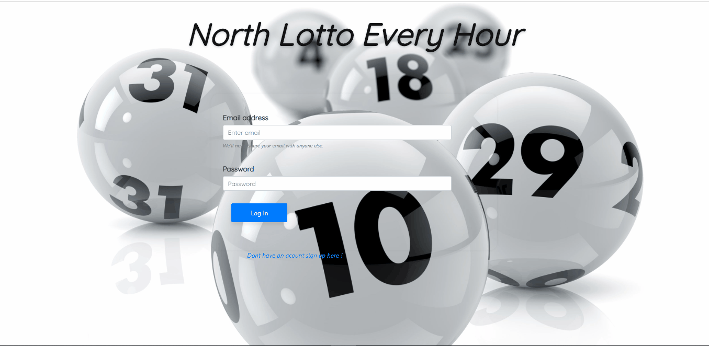

# North_Lotto_Every_Hour ⭐⭐⭐⭐⭐


## About the project 🚩
```bash
Idea of North Lotto Every Hour initialy came through workshop in SEDC academy.
Purpose of North Lotto Every Hour is based on real national Lottery including the same rules
where 'USERS' first of all need to create an account and log in. After that they will need to
add credit to their accounts to be able to create tickets only for the active session.
After completing first two steps 'USERS' will have to wait until draw is completed which is
happening every hour. Also they are able to see all their tickets including:
  * Status (Winning or not)
  * Selected numbers
  * Prize (if ticket has minimum 3 matches)
  * Number of session in which ticket belong
Also they are able to see all winners from all sessions, subscribe to our page and recieve
notifications from every draw on their emails and update their profiles.
From the other side there are our 'ADMINS' who are using different application. They are able to :
  * Start a draw every hour or activate the console app to do the job for them automaticly (MUST)
  * See all the users and their info (exept their passwords)
  * See all the winners
  * Make some of the users admins (this disable the specific users to create tickets anymore)
  * Update their profiles
```

## Goals 🚩

```bash
North Lotto Every Hour has one and only goal and that is to increase our users the needed adrenaline,
make their lives much more exciting and ofcourse the most important, make ritch the luckiest ones. 
```

## Technologies used 🚩

### Programming languages
```bash
  * HTML
  * CSS
  * JavaScript
  * C#
  * SQL (query language)
```

  ### Libraries and Frameworks
```bash
  * React
  * Redux
  * Entity framework
  * SignalR
  * ASP.NET Web API
  * Bootstrap
```

## Demo 🚩

### Admin actions


### Power of Signal R


### User actions


### User sign up action


